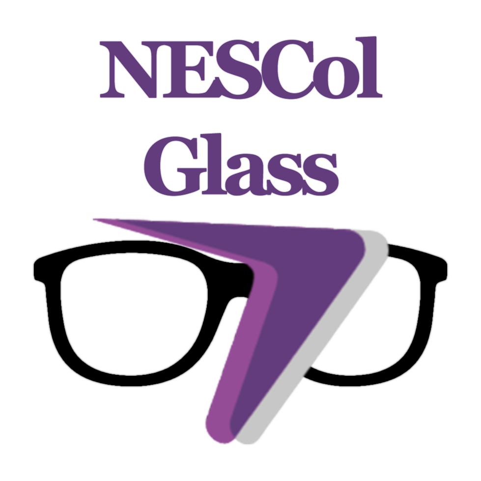
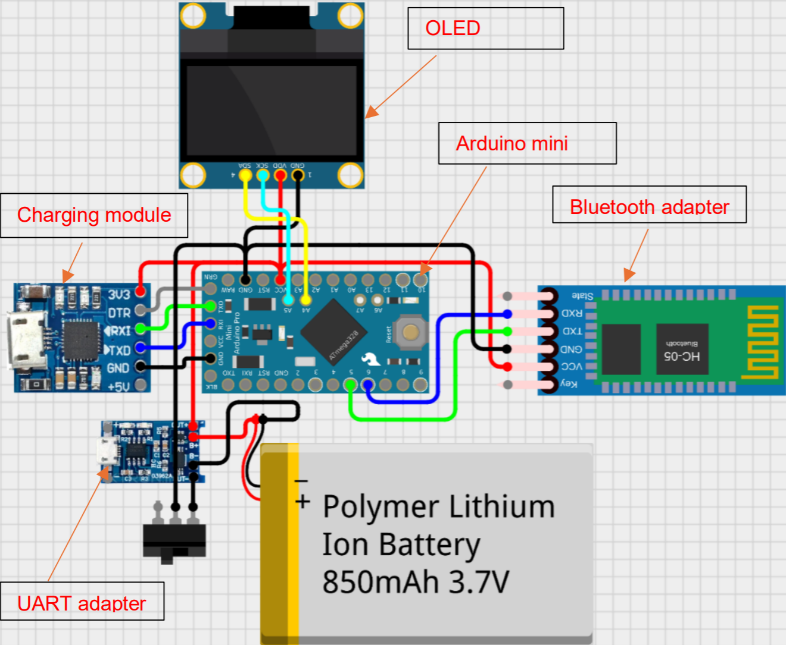
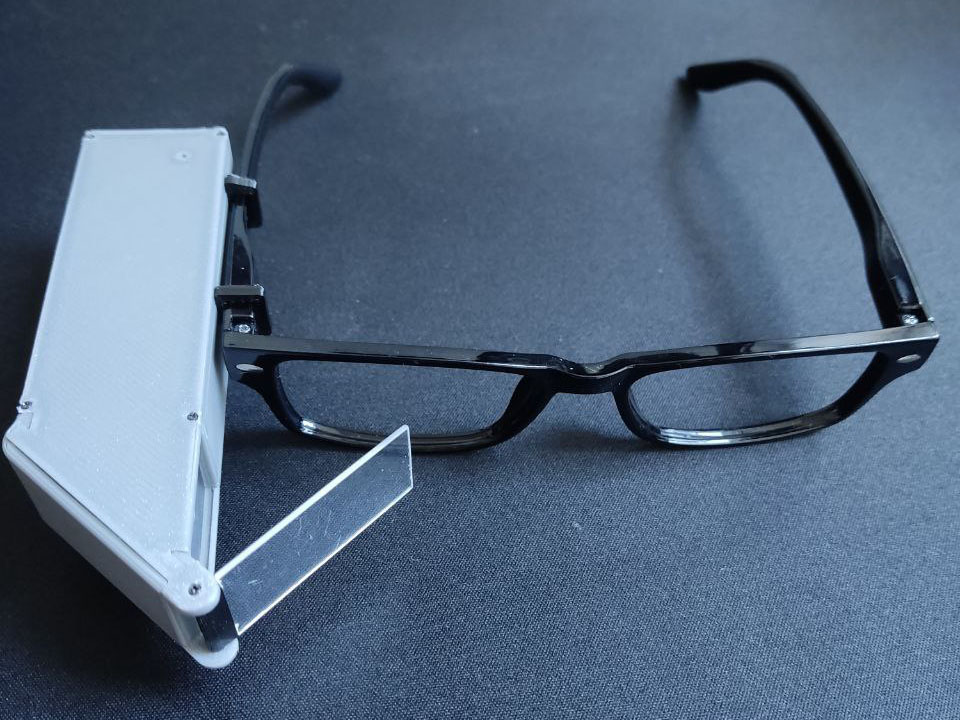
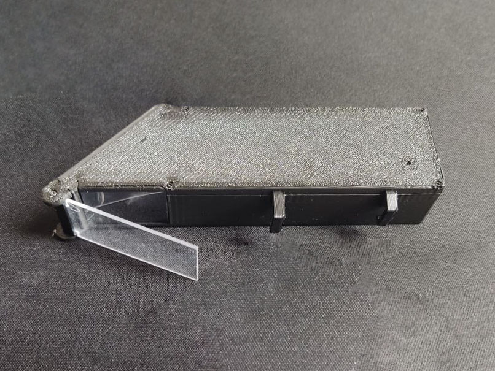
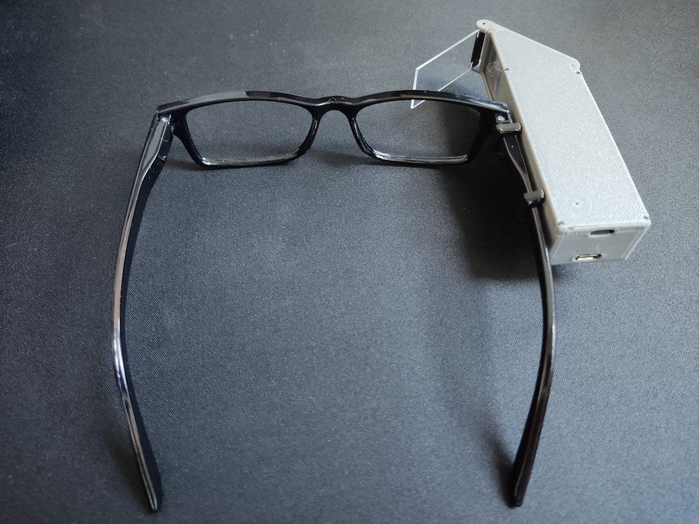
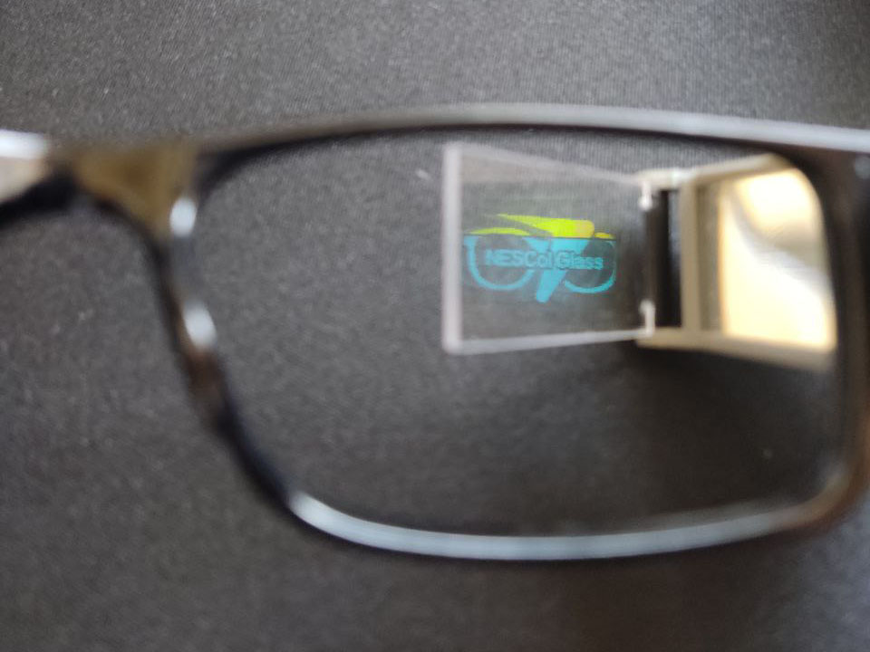

# NESCol Glass - Arduino Firmware

## Overview

The NESCol Glass firmware is the core software that powers the hardware components of the NESCol Glass wearable device. This Arduino-based firmware integrates with an OLED display, Bluetooth communication, and a rechargeable battery system to deliver critical functionality like notifications and HUD updates.

This firmware works seamlessly with the **NESCol Glass Android App**, allowing communication between the app and the wearable device.

## Features

- **Bluetooth Integration**: Enables communication between the Android app and the NESCol Glass device.
- **HUD Display**: Information is displayed on the transparent heads-up display via an OLED screen.
- **Power Management**: Efficient battery usage and charging integration with a Polymer Lithium Ion battery.
- **Arduino Integration**: Firmware developed for Arduino Mini Pro for hardware control.
- **Custom Hardware**: Includes Bluetooth adapters, charging modules, and an OLED screen.

## Electrical Scheme

### System Diagram

## Hardware Prototype

### Front View

### Side View

### Rear View

### Inside View

## About Us

We are a group of college students passionate about computing, hardware development, and innovative technology. The NESCol Glass firmware is an essential part of our concept project, ensuring smooth and reliable communication between hardware and software components.

### Group Members

- **Oliver Rennie**
- **Roman Hrynchak**
- **Oleksandr Reshetnikov**
- **Bogdan-Cristian Ardeleanu**

---

## Future Development

The firmware is currently under active development, with goals to improve:

- Power efficiency
- OLED display optimization
- Additional communication protocols

Stay tuned for updates on firmware enhancements and new features!
